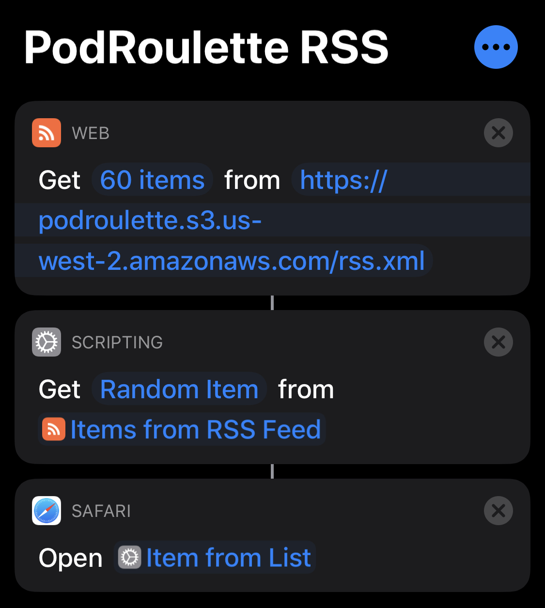

The problem: There are a million excellent podcasts out there, and you just can't make up your mind which one to listen to right now.

The solution: Machines 🤖.

This repo contains an RSS feed XML with a list of podcasts. A GitHub Action deploys it to an S3 bucket. 
I have an iOS [shortcut](https://apps.apple.com/us/app/shortcuts/id915249334) that pulls down this feed, picks a random item from it, and opens it in Spotify.

The shortcut is configured like this:

Enjoy all the free time you have now from having your podcasts chosen for you 🌴.

And shout out to the [Paradox of Choice](https://www.goodreads.com/book/show/10639.The_Paradox_of_Choice), an excellent book about how we humans don't do well when we're overwhelmed with choices.
